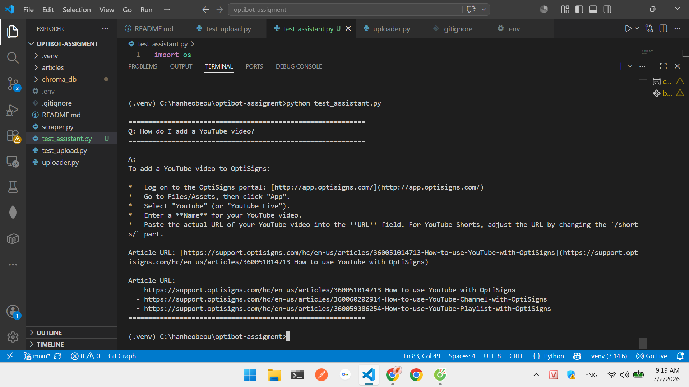

# OptiBot Mini-Clone

A mini-clone of OptiSigns' OptiBot support assistant. Scrapes the OptiSigns
Help Center, builds a local vector store, and answers support questions with
cited sources using the Gemini API.

---

## How It Works

### 1. Scraping (`main.py` / `scraper` logic)
- Calls the **public Zendesk Help Center API** at
  `support.optisigns.com/api/v2/help_center/en-us/articles.json`
- Paginates automatically (`next_page`) to collect all published articles.
- Converts each article's HTML body to **clean Markdown** using `markdownify`:
  strips `<script>`, `<style>`, image tags; preserves headings, links, code blocks.
- Saves one `<slug>.md` file per article with an `Article URL:` header
  so the assistant can cite the source later.

### 2. Delta Detection
- On every run, computes a **SHA-256 hash** of each article's rendered Markdown.
- Compares against `state/article_state.json` from the previous run.
- Classifies each article as `new`, `updated`, or `unchanged`.
- Only `new` + `updated` articles are re-embedded — unchanged ones are skipped,
  saving API cost.

### 3. Vector Store — Chunking & Embedding
- **Why ChromaDB?** The new `google-genai` SDK no longer supports the
  Corpus/Semantic Retrieval API that existed in the deprecated
  `google-generativeai` package. Thus, I switched to **ChromaDB** (local,
  persistent vector database) + Gemini's `gemini-embedding-2` model,
  which gives me full control and no vendor lock-in on the storage side.
- **Chunking strategy:** each Markdown file is split into overlapping chunks
  of **1500 characters with 150-character overlap**. Articles are already
  single-topic documents, so this size keeps each chunk semantically focused
  without over-splitting short articles.
- Each chunk is embedded via `client.models.embed_content(model="gemini-embedding-2")`
  and stored in ChromaDB with metadata: `source` (Article URL) and `slug`.

### 4. Assistant Query Flow
- User question → embedded → ChromaDB similarity search (top 5 chunks)
- Top chunks passed as context to `gemini-2.0-flash` with the OptiBot system prompt
- Response includes bullet-point answer + `Article URL:` citations

---

## Setup

```bash
git clone <this-repo>
cd <this-repo>
python -m venv .venv

# Windows
.venv\Scripts\activate
# Mac/Linux
source .venv/bin/activate

pip install -r requirements.txt
cp .env.example .env      # then fill in your GEMINI_API_KEY
```

---

## Run Locally

**Full daily job** (scrape + detect delta + upload):
```bash
python main.py
```

**Test the assistant** (ask a question, see cited answer):
```bash
python test_assistant.py
```

**First-time bulk upload** (if you want to upload all articles at once):
```bash
python uploader.py
```

---

## Run with Docker

```bash
docker build -t optibot-job .
docker run -e GEMINI_API_KEY=your-key-here optibot-job
```

Runs once, prints added/updated/skipped counts, exits with code 0.

---

## Deploy Daily Job on Railway

1. Push this repo to GitHub (use a non-obvious repo name, not "optisigns-*").
2. Go to [railway.app](https://railway.app) → **New Project** →
   **Deploy from GitHub repo** → select this repo.
   Railway auto-detects the `Dockerfile`.
3. Under **Variables**, add: `GEMINI_API_KEY=your-key-here`
4. Under **Settings → Cron Schedule**, set: `0 7 * * *` (runs daily at 07:00 UTC).
5. Railway runs the container once per schedule and exits automatically.

**Link to daily job logs:**
> _Add your Railway deployment logs URL here after deploying_
> Example: `https://railway.app/project/<id>/deployments`

---

## Screenshot



---

## Project Structure

```
.
├── main.py                 # daily job: scrape + delta + upload
├── uploader.py             # bulk upload all .md to ChromaDB
├── scraper.py              # collect all published articles
├── test_assistant.py       # ask OptiBot a question
├── articles/               # scraped Markdown files (gitignored)
├── state/                  # article_state.json for delta detection
├── chroma_db/              # local vector store (gitignored)
├── Dockerfile
├── requirements.txt
└── .env.sample
```